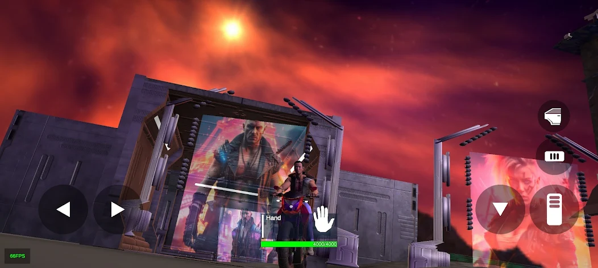
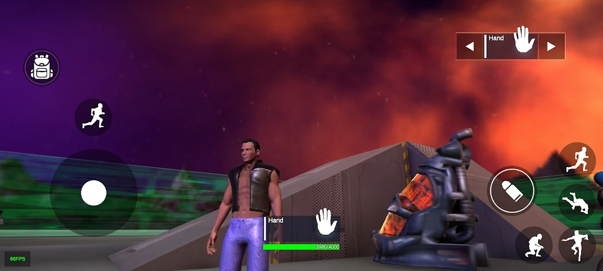
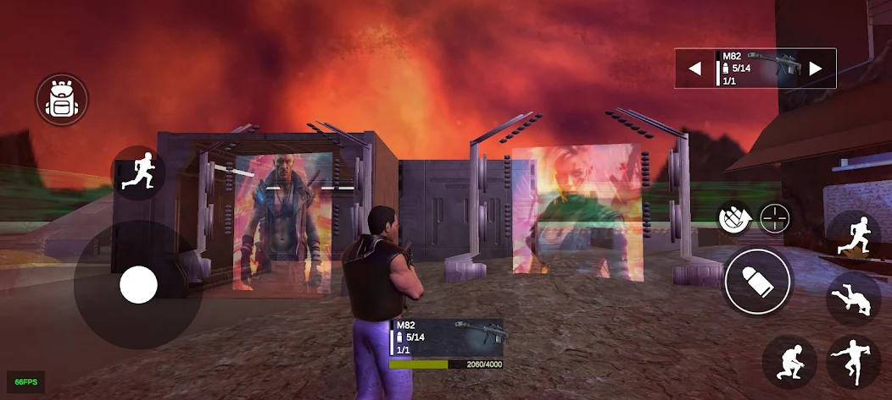
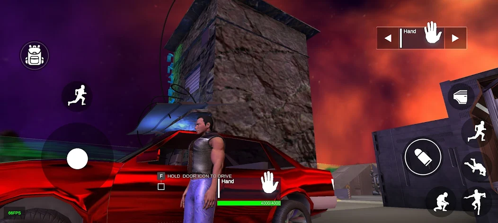

# Argon Raider

**Argon Raider** is a sci-fi action mobile game developed using the **Unity Game Engine** and programmed in **C#**.
The game is published and available on the **Google Play Store**.

The project demonstrates gameplay systems, player mechanics, enemy AI behavior, weapon systems, and vehicle interactions optimized for mobile devices.

---

## Google Play Release

Download the game:

https://play.google.com/store/apps/details?id=com.MnemoteknikStudio.ArgonRaider

---

## Gameplay Screenshots

---

## Game Features

* Sci-fi action gameplay
* Player movement and combat mechanics
* Drivable vehicles
* Dynamic enemy AI
* Multiple weapon systems
* Sniper rifles and grenades
* Melee combat
* Inventory and item management system
* Interactive environment

---

## Technology Stack

**Game Engine**

* Unity

**Programming Language**

* C#

**Platform**

* Android

**Deployment**

* Google Play Store

**Core Systems**

* Player Controller
* Enemy AI Behavior
* Weapon System
* Inventory System
* Vehicle Control Mechanics
* Physics and Collision Systems

---

## Development Overview

Argon Raider was developed using the Unity engine with gameplay logic implemented through C# scripts.

The development process included:

* Designing gameplay mechanics and player interactions
* Implementing AI behavior systems for enemies
* Creating weapon and combat mechanics
* Building an inventory system for items and equipment
* Integrating vehicles and physics-based interactions
* Optimizing the project for Android mobile devices

Unity compiles the C# scripts and generates the Android build package (APK), which is distributed through the Google Play platform.

---

## Repository Purpose

This repository showcases the development of a published mobile game and highlights experience in:

* Unity game development
* Object-oriented programming in C#
* Mobile game architecture
* Android deployment pipeline
* Gameplay system design

---

## Developer

Cristian Nastasă
owner of Menmoteknik Studio and MnemoTek
Mnemoteknik Studio

